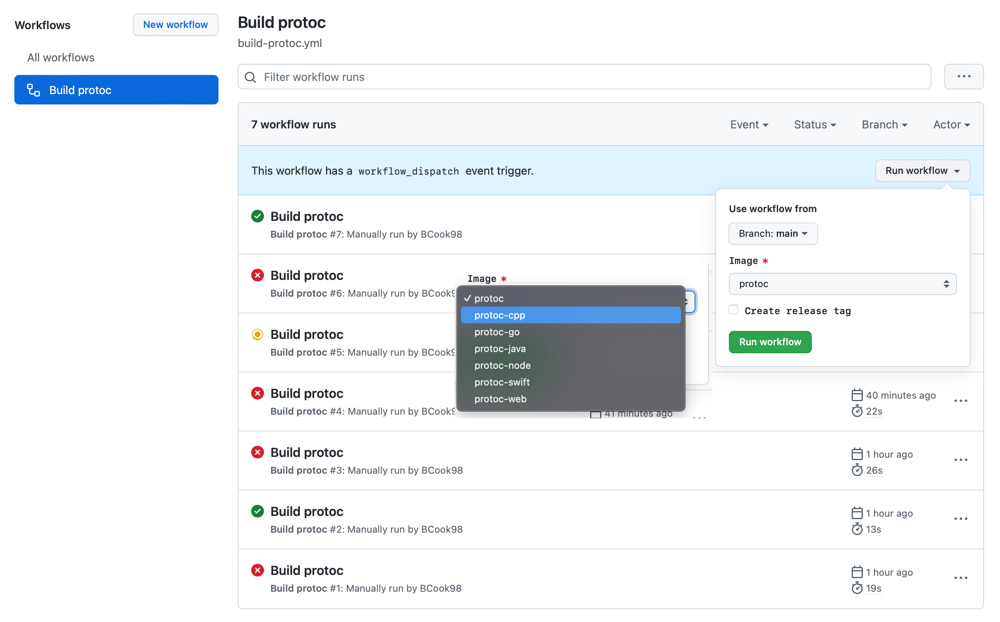

# Protobuf Compiler Docker Containers

## Overview

This repository contains Dockerfiles that build protocol buffer generation scripts for SafetyCultures supported languages. Removing the need to setup Protoc (v3) on your local machine. It relies on setting a simple volume to the docker container, and it will take care of the rest.

### What to run

Before invoking a target,

- update the version in xxx/version.txt. This version will be used to tag the new docker image.
- update the relevant version info in the Dockerfile for the respective language.
- trigger a new build https://github.com/SafetyCulture/protoc-docker/actions/workflows/build-protoc.yml and select the image you want to build.
If `Create release tag` is unselected the image will be tagged with `${version}-pre#{datetime}`.



Alternatively you can manaully build and publish these images by running the following make commands.

```txt
buildAll       Generates all the protoc docker containers
cpp            Builds the protoc docker container for `cpp`
go             Builds the protoc docker container for `go`
java           Builds the protoc docker container for `java`
node           Builds the protoc docker container for `node`
protoc         Builds the protoc docker container
swift          Builds the protoc docker container for `swift`
web            Builds the protoc docker container for `web`
```

After a docker image has been created, push it to SC docker repository using `docker push <image-name>`; for e.g., `docker push safetyculture/protoc-go:2.4.1` or you can use `make push language=go`. Please note that one must be signed in to push the image to SC docker repository.
